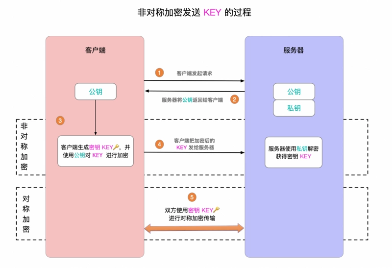

https通信过程可以分为两大过程
证书校验, 数据传输
1. 客户端发起请求
2. 服务器端将公钥返给客户端
3. 客户端生成密钥key, 并使用公钥对key进行加密
4. 客户端把加密后的key发送给服务器端, 服务器端使用私钥对key进行解密获得key
5. 双方使用密钥key对传输内容进行对称加密

SSL安全套接字层
用于保障在Internet上数据传输安全，位于TCP/IP协议与各应用层协议之间,为数据通讯提供安全支持.
SSL协议分为两层：SSL记录协议(他建立在可靠传输协议之上 e.g. TCP),为高层提供数据封装、压缩、加密等基本功能。
SSL握手协议,他建立在SSL记录协议之上,用于在实际数据传输开始前,通信双方进行身份认证、协商加密算法、交换加密密钥

TLS传输层安全协议
用于两个应用程序之间提供保密性和数据完整性。TLS是一种新的协议, 建立在SSL3.0协议规范之上,是SSL3.0的后续版本
该协议由两部分组成:
TLS记录协议,TLS握手协议

TLS使SSL更安全,并使用协议规范更精确和完善,增强内容如下:
1. 更安全的mac算法
2. 更严密的警报

### http
http建立在TCP/IP协议之上, TCP数据传输控制, IP节点之前进行通信。TCP建立连接前将拆为IP数据包