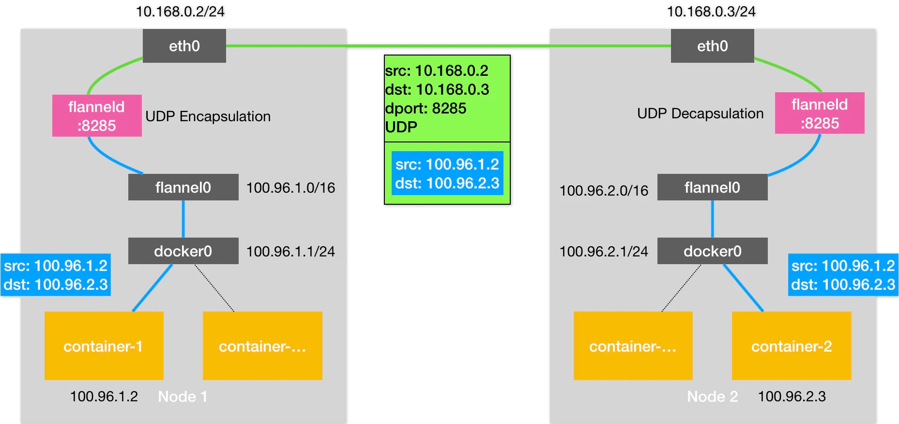
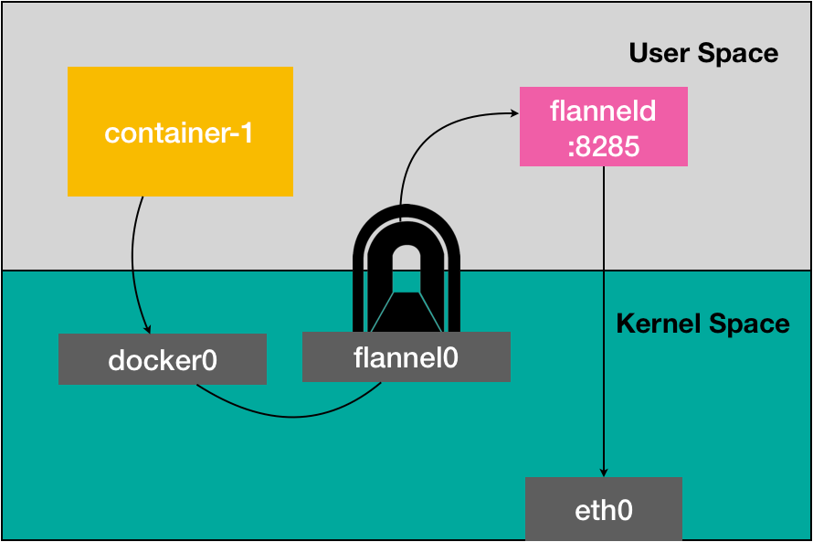
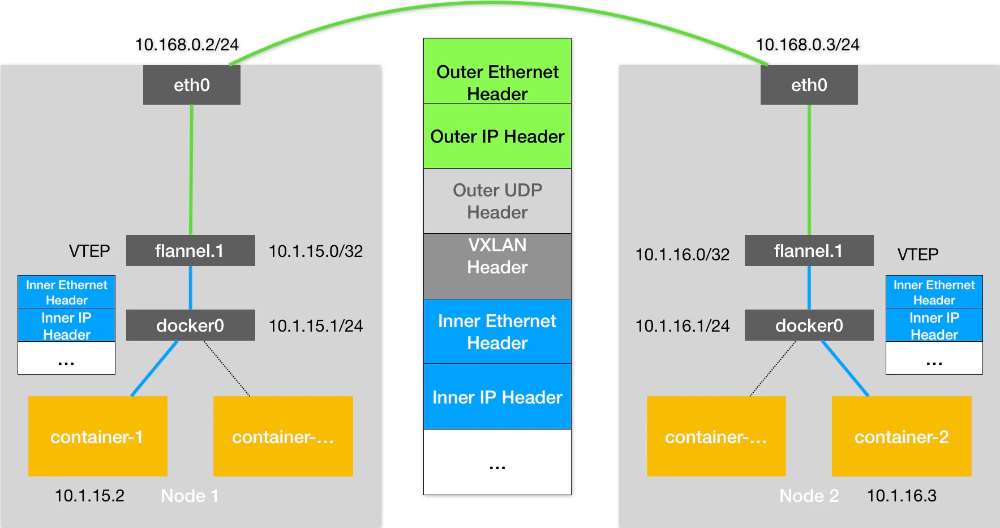
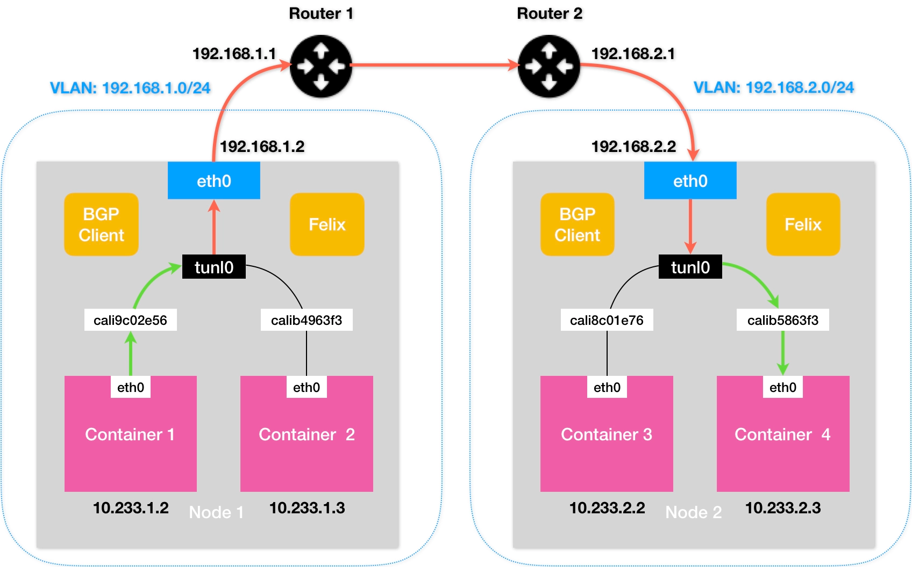

## flannel cni

### flannel udp模式

创建一个TUN设备工作在三层网络,在内核和应用程序之间传递ip包。和docker0的连接通过发送的目的ip
地址段被设置进flannel0相关的route上了

数据流动方向:

container1 --> docker0 --> flannel0(TUN设备) --> flanneld(host1应用程序) --通过
etcd中查找子网信息--> flanneld(host2应用程序)--> flannel0(TUN设备) --> docker0 --> 
container2



flannel udp的性能损耗:


### flannel vxlan模式

由于udp在内核和用户态切换次数太多, 比较消耗性能。所以我们优化的原则是尽量减少用户态和内核态的切换。 
VXLAN(Virtual Extensible LAN), 这是linux内核本身就支持的一种网络虚拟化技术，所以vxlan可以
完全在内核态完成封装和解封装的工作从而通过类似"隧道"的方式构建出覆盖网络。

设计思想:
在现有的三层网络之上，"覆盖"一层虚拟的、由内核vxlan模块负责的二层网络, 使得连接在这个二层网络之上 
的"主机"之间可以像在局域网里那样自由通信。这些"主机"可以分布在不同的宿主机或者机房。为了在二层网络
上打通隧道，VXLAN在宿主机上设置一个特殊的网络设备VTEP作为"隧道"的两端，而这个设备在进行封装和解包 
的对象是二层数据帧，这个工作的执行流程都是在内核态完成的

基于VTEP的"隧道"通信流程:


数据流动方向:
container1 --> docker0 ---> flannel.1(host1 VTEP设备, flanneld进程会维护所有节点在主机
上的route 规则) --> flannel.1(host2 VTEP设备) -->docker0 --> container2

### flannel host-gw模式

基础知识

```
$ ip route...10.244.1.0/24 via 10.168.0.3 dev eth0
```

这条路由规则的含义: 目的IP地址属于 10.244.1.0/24 网段的IP包,应该经过本机的eth0设备发出去,并
且他的下一跳地址是10.168.0.3。

原理: 将每个flannel子网的"下一跳"地址设置为改子网对应的主机的IP地址。

要求: host-gw、vxlan都需要宿主机之间二层联通


## Calico

calico的网络解决方案跟host-gw几乎完全一样, calico会在没台宿主机上添加格式如下的路由规则。
```
<目的容器IP地址段> via <网关的IP地址> dev eth0
```
正如前面所说,三层网络方案得以正常工作的核心是为每个容器的IP地址找到他的下一跳地址。Calico与
flannel的不同之处在于使用了BGP(边界 网关协议)来为整个集群分发路由。

### calico构成
* calico的CNI插件, 这是calico跟kubernetes对接的部分
* felix 他是一个Daemonset,负责在宿主机上插入路由规则以及维护calico所需的网络设备
* BIRD 是一个BGP的客户端,专门负责在集群里分发路由规则

跟host-gw的不同之处还有一个就是不会创建任何网桥
```
[BGP消息]
我是宿主机192.168.1.3
10.233.2.0/24网段的容器都在我这里
这些容器的下一跳地址是我
```

> calico的网络在默认情况下是Node-to-Node-Mesh模式, 当需要维护大量节点时会增大集群的网络带宽, 
> 所以这种模式一般节点控制在100个节点，而更大规模的集群则需要Route Reflector模式

### Route Reflector
这种模式下calico会专门挑几个节点作为代理，通过BGP协议学习路由规则。其他节点和这几个节点进行信息
交换路由信息就可以获取整个集群的路由规则了。

### IPIP模式
calico也是需要在二层联通的情况下工作，如果使用不同的子网需要开启ipip模式。会增加一个tunl设备(一
个IP隧道)

