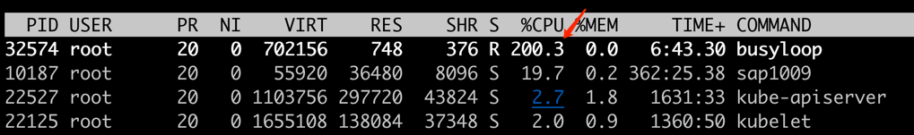

`cgroup` 用于控制进程的资源消耗.下面以一个示例说明。
这段`golang`代码，主要是为了空跑`cpu`,如果不对资源做限制，默认情况会跑满两个`cpu`
```go
func main() {
	go func() {
		for {

		}
	}()

	for {

	}
}
```
编译程序并运行，观察`cpu`使用情况
```
GOOS=linux go build -o busyloop

./busyloop
```


接下来我们来控制该进程的cpu使用
1. `cgroup`下创建`cpudemo`
```
cd /sys/fs/cgroup/cpu
mkdir cpudemo // 创建以后系统会自动生成相关文件
```

2. 写入进程号到`cgroup.procs`
```
cd cpudemo
echo 32574 > cgroup.procs
```

3. 以绝对值控制`cpu`使用情况, 该目录下有两个文件`cpu.cfs_quota_us`(进程`cpu`使用量,默认为-1不做限制)、`cpu.cfs_period_us`(一个cpu的整个周期, 默认为100000)
```
// 设置cpu使用为0.1个cpu
echo 10000 > cpu.cfs_quota_us
```

