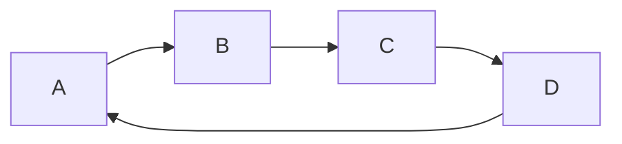
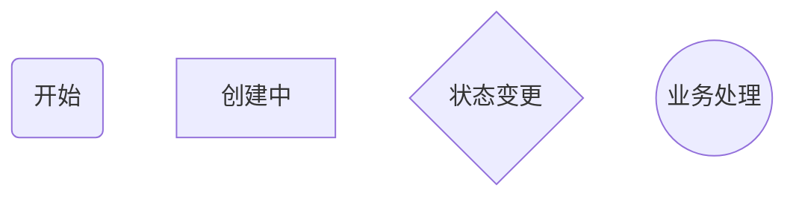
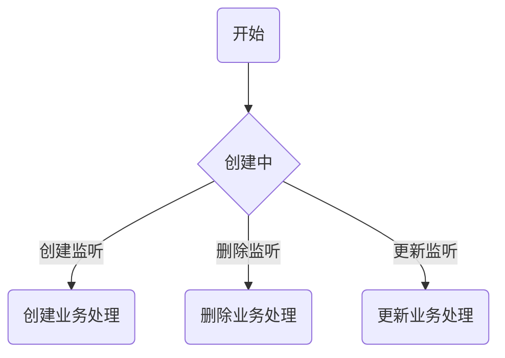
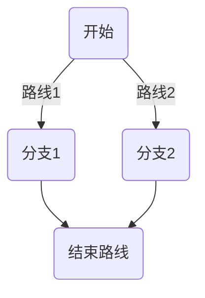
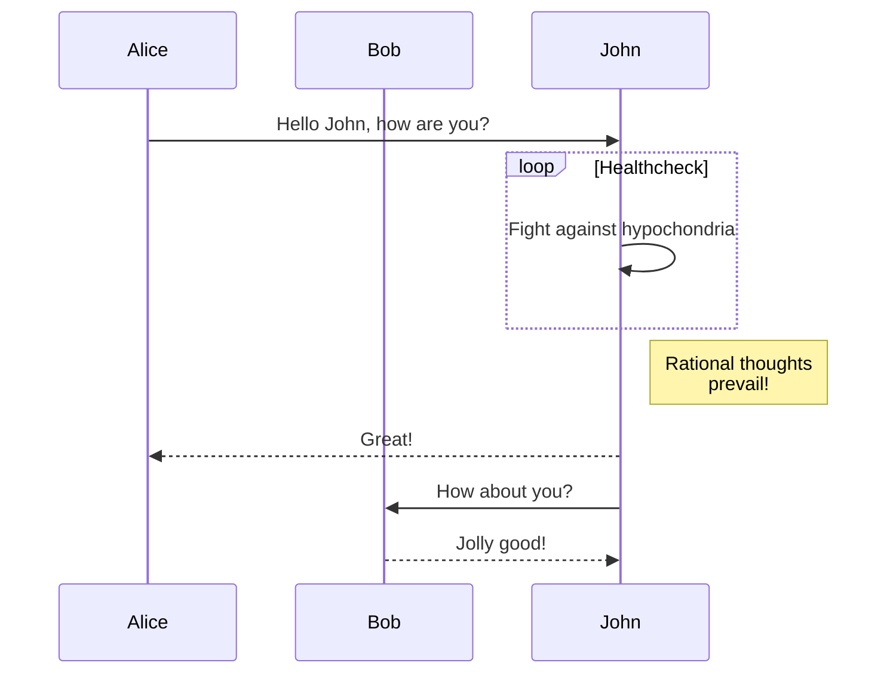
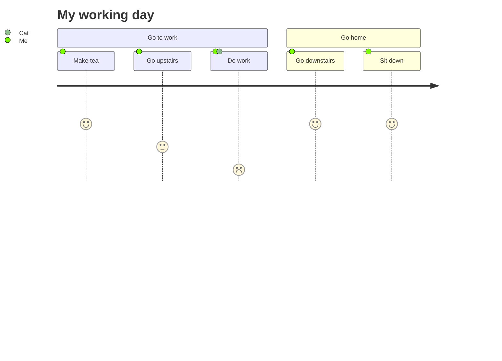
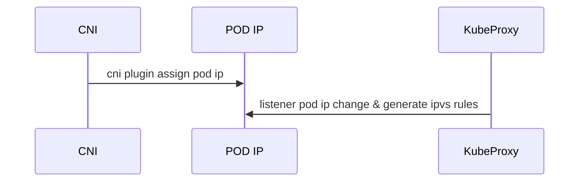
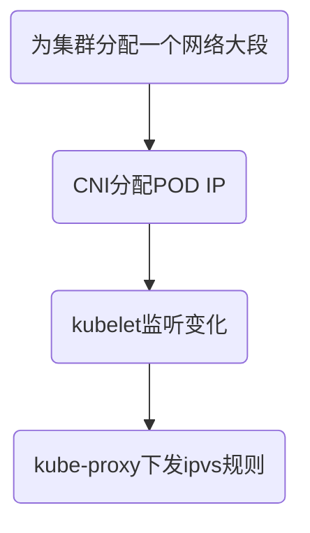
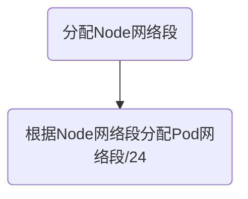

md demo use mermaid

```mermaid
graph LR;
	A-->B;
	B-->C;
	C-->D;
	D-->A;
```

```mermaid
graph TB;
    A(开始)
    B[创建中]
    C{状态变更}
    D((业务处理))
```

```mermaid
graph TB;
    A(开始)-->B{创建中};
    B--> |创建监听|C(创建业务处理)
    B--> |删除监听|D(删除业务处理)
    B--> |更新监听|E(更新业务处理)
```

```mermaid
graph TB;
    A(开始)-->|路线1|B(分支1);
    A(开始)-->|路线2|C(分支2);
    B-->D(结束路线);
    C-->D(结束路线)
```

```mermaid
sequenceDiagram
    participant Alice
    participant Bob
    Alice->>John: Hello John, how are you?
    loop Healthcheck
        John->>John: Fight against hypochondria
    end
    Note right of John: Rational thoughts <br/>prevail!
    John-->>Alice: Great!
    John->>Bob: How about you?
    Bob-->>John: Jolly good!
```

```mermaid
journey
    title My working day
    section Go to work
      Make tea: 5: Me
      Go upstairs: 3: Me
      Do work: 1: Me, Cat
    section Go home
      Go downstairs: 5: Me
      Sit down: 5: Me
```

#### 正文:

```mermaid
sequenceDiagram
    participant CNI
    participant POD IP
    participant KubeProxy
    CNI->>POD IP: cni plugin assign pod ip
    KubeProxy->>POD IP: listener pod ip change & generate ipvs rules
```

kubernetes中POD IP生成和生效流程

```mermaid
graph TB;
    A(为集群分配一个网络大段) --> B(为主机分配一个网络段)
    B(CNI分配POD IP)-->C(kubelet监听变化);
    C-->D(kube-proxy下发ipvs规则)
```

cni如何实现不冲突的IP

```mermaid
graph TB;
    A(分配Node网络段)-->B(根据Node网络段分配Pod网络段/24)
```