### tcpdump 入门
|  参数分类  | 常用关键字  |
|  ----  | ----  |
| 类型  | host、port |
| 方向  | src、dst |
| 协议  | ip、tcp、udp |
| 逻辑  | and、or、not |
| 其他  | -i 指定网卡eth0、eth1、tunl0、any，  -s 指定包长度,-s 0表示抓取完整包,  -c 指定抓包的数量,   -n 以数字方式显示ip、port   -A 以ASCII打印数据包 |

### 常见标志位
|  标志位  | 说明  |
|  ----  | ----  |
| SYN  | 发起连接 |
| ACK  | 确认连接 |
| PSH  | 可以直接将数据传给应用程序 |
| FIN  | 关闭连接 |
| RST  | 重置(异常关闭)连接 |

### 三次握手
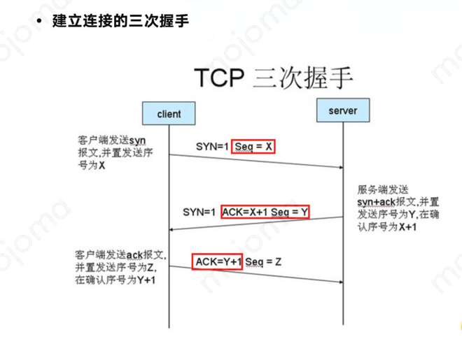

### 关闭连接的四次挥手
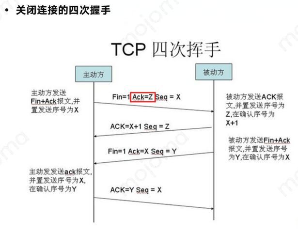

### 一次完整的交互实例
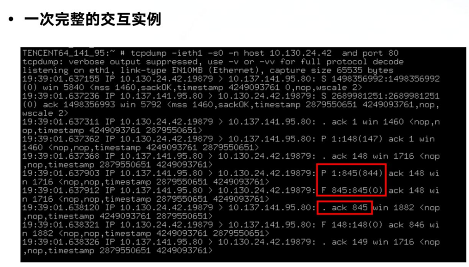

### RST
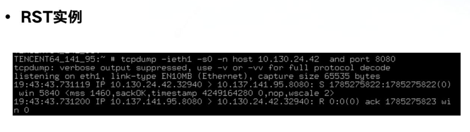

### 关于tunl包
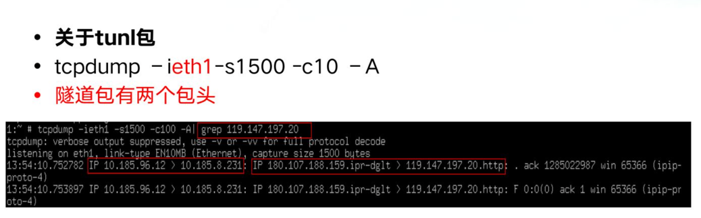

### 确定使用的是哪一个CGI
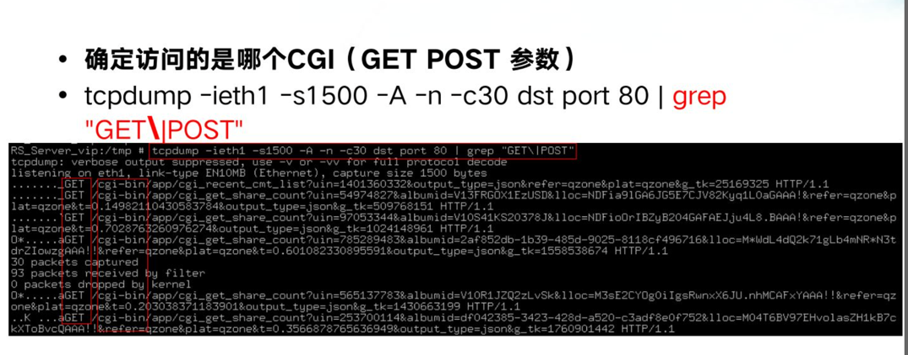

### 同样的方法抓取referer
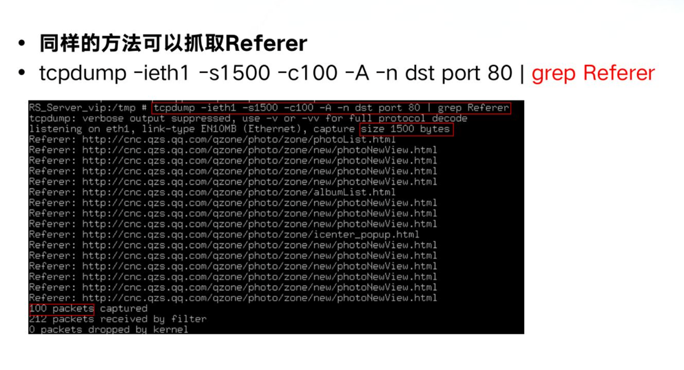

### 关于QHTTP的QVIA字段
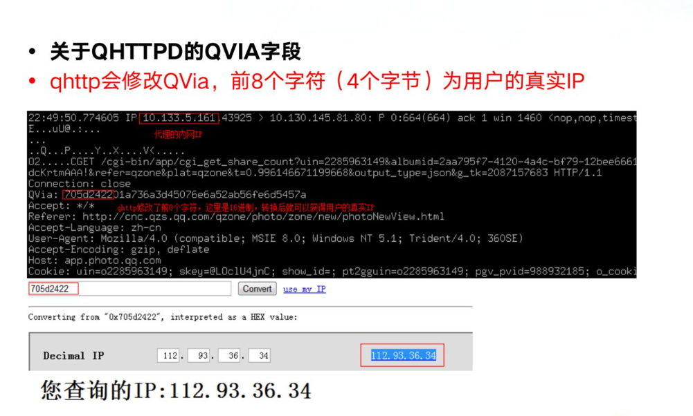

### 抓取RST
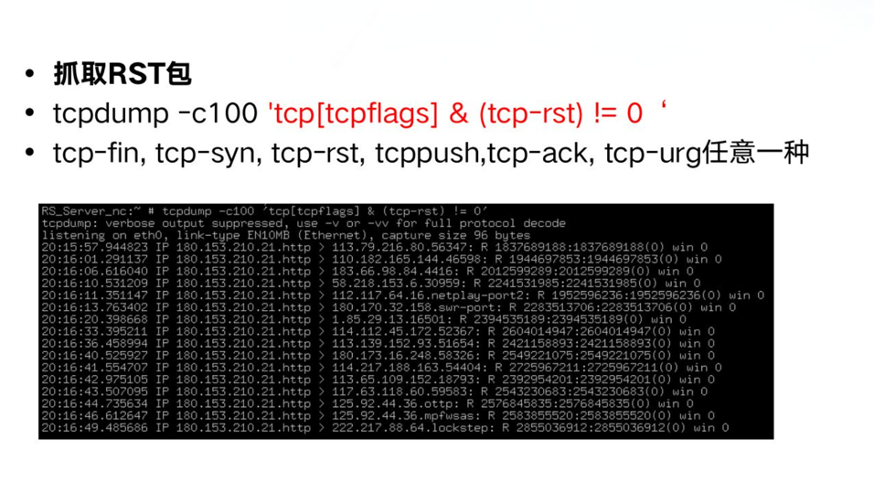

### 抓取403、500等异常请求
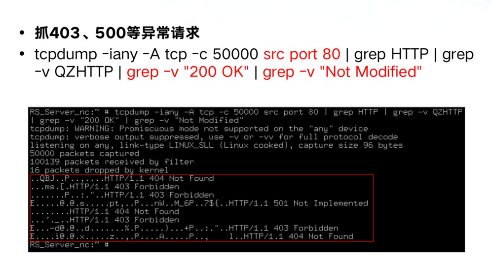

### 统计返回码次数
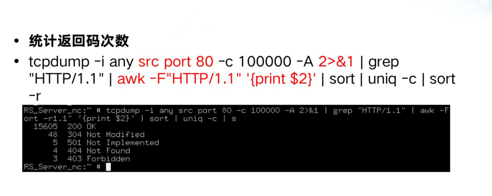

### 统计包请求来源
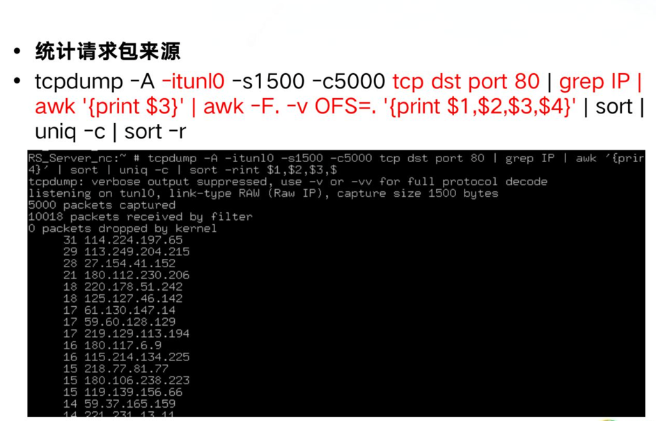

### 统计包请求域名
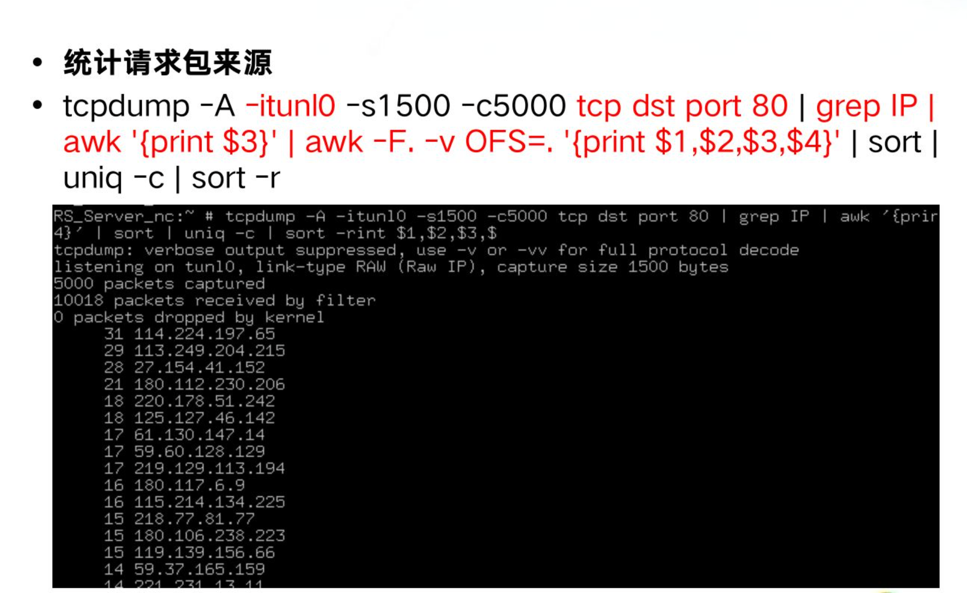